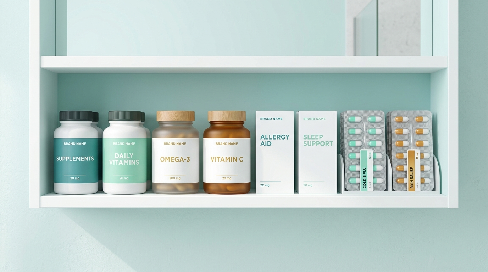

# Pillshelf 💊📦

<p align="center">
  
</p>

<p align="center">
  <b>Розумна аптечка, трекер прийому ліків та моніторинг цін в аптеках України</b><br>
  <i>Smart medicine cabinet, pill adherence tracker, and Ukrainian pharmacy price monitor</i>
</p>

<p align="center">
  
  
  
  
  
</p>

<p align="center">
  <a href="#-українська-версія">🇺🇦 Українська версія</a> •
  <a href="#-english-version">🇬🇧 English Version</a>
</p>

---

## 🇺🇦 Українська версія

### 📖 Огляд проекту (Project Overview)
**Pillshelf** — це сучасний, приватний та повністю автономний (offline-first) Android-застосунок, розроблений для комплексного контролю домашньої аптечки, розкладу прийому медикаментів, відстеження термінів придатності та моніторингу цін у провідних аптечних мережах України з інтеграцією швидкого пошуку через сервіс Tabletki.ua.

Усі персональні дані, історія прийомів та списки медикаментів зберігаються виключно на вашому пристрої в локальній базі даних без передачі на сторонні сервери.

---

### 📱 Скріншоти інтерфейсу (Screenshots Placeholder)

| 🏠 Аптечка (Shelf) | ⏰ Розклад (Schedule) | 💰 Ціни (Prices) | 📜 Журнал (History) |
| :---: | :---: | :---: | :---: |
| _[Скріншот списку ліків, пошуку та категорій]_ | _[Скріншот карток прийому на сьогодні з прогресом]_ | _[Скріншот динаміки цін, трендів та Tabletki.ua]_ | _[Скріншот журналу прийомів та статистики комплаєнсу]_ |

---

### ✨ Функціональні можливості (Feature List)

#### 1. 💊 Домашня аптечка (Shelf Management)
- **Детальний каталог препаратів**: збереження торгової назви, форми випуску (таблетки, капсули, сироп, краплі, спрей, мазь тощо), діючої речовини, дозування та категорії.
- **Розумний контроль залишків**: миттєве сповіщення про низький запас ($\le 5$ од.) та закінчення препарату ($0$ од.).
- **Швидке поповнення запасу**: зручне меню поповнення зі швидкими пресетами (+10, +20, +30, +60 од.) або довільним значенням.
- **Моніторинг термінів придатності**: підсвічування прострочених препаратів червоним та попередження про ліки, строк яких спливає найближчим часом ($< 30$ днів).
- **Колірна диференціація**: вибір кольорової мітки для швидкої візуальної навігації.
- **Фільтрація та живий пошук**: миттєвий пошук за назвою або діючою речовиною, фільтри за категоріями («Знеболювальні», «Застуда та грип», «Вітаміни», «ШКТ», «Антибіотики» тощо).

#### 2. ⏰ Щоденний розклад та контроль прийому (Schedule & Adherence)
- **Гнучкі режими прийому**:
  - `DAILY` — добовий графік за часом дня (Ранок 08:00, День 14:00, Вечір 20:00).
  - `EVERY_N_HOURS` — регулярні інтервали (наприклад, кожні 4, 6 або 8 годин).
  - `COURSE` — фіксовані курси лікування (наприклад, антибіотики на 7–10 днів).
  - `AS_NEEDED` — прийом за вимогою чи симптоматично.
- **Контекст вживання їжі**: інструкції «До їжі», «Під час їжі», «Після їжі» або «Незалежно від їжі».
- **Швидкі дії в один дотик**:
  - **«Прийняти»**: автоматично списує 1 дозу з аптечки та зберігає факт прийому в журналі з точним часом.
  - **«Пропустити»**: реєструє пропуск без списання залишку.
- **Індикатор прогресу дня**: прогрес-бар виконання щоденного плану та відсоток завершення.

#### 3. 💰 Моніторинг цін та аптеки України (Prices & Aggregation)
- **Порівняння цін**: відображення цін у популярних українських аптечних мережах (АНЦ, Бажаємо Здоров'я, Аптека Подорож, Аптека 9-1-1).
- **Аналізатор цінових трендів**: розрахунок динаміки за останні 30 днів (Зростання $\nearrow$, Падіння $\searrow$, Стабільна $\rightarrow$) із зазначенням відсотка.
- **Відстеження цільової ціни**: налаштування бажаного порогу вартості для отримання сповіщення про вигідну покупку.
- **Інтеграція з Tabletki.ua**: прямий перехід до сторінки ліків на сайті Tabletki.ua в один клік для перевірки наявності та бронювання.

#### 4. ⚠️ Автоматичний аналізатор лікарських взаємодій
- **Захист від дублювання парацетамолу**: виявлення одночасного прийому комбінованих чаїв від застуди (Фервекс, Терафлю тощо) та парацетамолу в таблетках для запобігання гепатотоксичності.
- **Попередження про НПЗП**: виявлення одночасного вживання кількох нестероїдних протизапальних засобів (ібупрофен, аспірин, диклофенак).
- **Правила прийому антибіотиків**: нагадування про проходження повного курсу лікування.

#### 5. 📜 Журнал прийому та аналітика (History Log)
- Хронологічна стрічка всіх записів прийомів із часовими мітками.
- Розрахунок відсотка дотримання схеми лікування (Adherence rate).
- Функція **«Скасувати»**: скасування помилкового запису з поверненням списаної дози в аптечку.

#### 6. 🔔 Сповіщення та фонові служби (WorkManager)
- `ReminderWorker`: періодичний перегляд розкладу кожні 15 хвилин та відправка системних повідомлень.
- `PriceCheckWorker`: фонова перевірка зниження цін кожні 12 годин.
- Сповіщення про низький або вичерпаний запас ліків.

---

### 🛠️ Інструкція зі збирання та запуску (Build Instructions)

#### Системні вимоги
- **JDK**: Java 21 LTS
- **Android Studio**: Ladybug (2024.2.1) або новіша
- **Android SDK**: API 36 (Android 16), мінімальна версія API 26 (Android 8.0)
- **Gradle**: 9.3.1 (Android Gradle Plugin 9.1.1)

#### Клонування та збирання
1. Клонуйте репозиторій:
   ```bash
   git clone https://github.com/your-username/pillshelf.git
   cd pillshelf
   ```
2. Зберіть проект за допомогою Gradle:
   ```bash
   gradle assembleDebug
   ```
3. Запустіть юніт-тести:
   ```bash
   gradle testDebugUnitTest
   ```
4. Встановіть APK на підключений пристрій або емулятор:
   ```bash
   gradle installDebug
   ```

---

### 🗺️ План розвитку проекту (Roadmap)
- [x] **Базовий облік аптечки**: додавання ліків, відстеження залишків та термінів придатності.
- [x] **Розклад та нагадування**: прийом ліків за розкладом, списання кількості, сповіщення через WorkManager.
- [x] **Моніторинг цін в аптеках України**: тренди цін та швидкий перехід до Tabletki.ua.
- [x] **Аналізатор взаємодій**: попередження про дублювання парацетамолу та комбінації НПЗП.
- [ ] **Сканування штрих-кодів та QR-кодів**: швидке додавання препаратів за допомогою камери пристрою.
- [ ] **Підтримка NFC-міток**: прийом ліків шляхом піднесення смартфону до флакона з NFC-стікером.
- [ ] **Експорт медичного звіту у PDF**: формування звіту прийому та залишків для сімейного лікаря.
- [ ] **Опціональне зашифроване резервне копіювання**: експорт/імпорт бази даних у Google Drive або WebDAV.
- [ ] **Додаток-компаньйон для Wear OS**: швидкі відмітки про прийом таблетки з годинника.

---

<br>

## 🇬🇧 English Version

### 📖 Project Overview
**Pillshelf** is a modern, private, and fully offline-first Android application crafted for home medicine cabinet organization, medication adherence tracking, expiration monitoring, drug interaction alerts, and Ukrainian pharmacy price tracking with direct Tabletki.ua integration.

All personal health data, medication inventory, and intake logs remain securely stored on your device in an encrypted/local database without external transmission.

---

### 📱 UI Screenshots (Screenshots Placeholder)

| 🏠 Shelf Screen | ⏰ Schedule Screen | 💰 Price Monitor | 📜 History & Analytics |
| :---: | :---: | :---: | :---: |
| _[Screenshot of cabinet inventory, search & categories]_ | _[Screenshot of today's schedule cards & progress]_ | _[Screenshot of price trends & Tabletki.ua shortcuts]_ | _[Screenshot of intake logs & adherence statistics]_ |

---

### ✨ Feature List

#### 1. 💊 Digital Medicine Cabinet ("Shelf")
- **Comprehensive Medicine Registry**: Trade name, dosage form (tablets, capsules, syrups, drops, inhalers, creams, etc.), active substance, strength, and therapeutic category.
- **Automated Stock Monitoring**: Visual alerts and notifications for low stock ($\le 5$ units) and out-of-stock items ($0$ units).
- **One-Tap Restock Dialog**: Convenient quick presets (+10, +20, +30, +60 units) or custom amount input.
- **Expiry Date Tracking**: Badges for active medications, items expiring within 30 days, and expired drugs.
- **Color Identification**: Visual color markers for immediate recognition of pill boxes.
- **Live Search & Filter**: Real-time search across names and active ingredients, plus category chip filters.

#### 2. ⏰ Daily Schedule & Adherence
- **Flexible Regimens**:
  - `DAILY`: Routine daily schedule (Morning 08:00, Afternoon 14:00, Evening 20:00).
  - `EVERY_N_HOURS`: Cyclic interval timing (e.g. every 4, 6, or 8 hours).
  - `COURSE`: Fixed duration therapy courses (e.g., 7-day antibiotic course).
  - `AS_NEEDED`: Symptomatic or PRN intake.
- **Meal-time Context**: Instructions for taking "Before meal", "With meal", "After meal", or "Anytime".
- **One-Tap Actions**:
  - **"Take"**: Decrements 1 dose from your inventory and records the intake timestamp.
  - **"Skip"**: Records a skipped dose without decrementing shelf stock.
- **Daily Adherence Indicator**: Visual progress bar reflecting completed daily doses.

#### 3. 💰 Price Tracking & Ukrainian Pharmacy Aggregation
- **Multi-Chain Price Monitoring**: Track and compare prices from major Ukrainian pharmacy chains (ANC, Bazhaiemo Zdorovia, Podorozh, Apteka 9-1-1).
- **30-Day Trend Analysis**: Automated trend identification (Rising $\nearrow$, Falling $\searrow$, Stable $\rightarrow$) with percentage change.
- **Target Price Alerts**: Configure desired price thresholds to purchase at optimal times.
- **Tabletki.ua Integration**: One-click shortcut to check availability and reserve medications via Tabletki.ua.

#### 4. ⚠️ Automated Drug-Drug Interaction Checker
- **Paracetamol Duplication Guard**: Detects concurrent usage of paracetamol powders/hot drinks (Fervex, Theraflu) and standard tablets to prevent overdose.
- **NSAID Co-Administration Warning**: Warns against taking multiple non-steroidal anti-inflammatory drugs simultaneously.
- **Antibiotic Course Guidance**: Enforces full course completion reminders.

#### 5. 📜 Intake History & Compliance Analytics
- Chronological timeline of all intake events (taken, skipped).
- Overall treatment compliance percentage (Adherence rate).
- **Undo Action**: Revert accidental intake logs, restoring shelf stock immediately.

#### 6. 🔔 Background Workers & Notifications (WorkManager)
- `ReminderWorker`: Periodic intake evaluations every 15 minutes sending timely Android notifications.
- `PriceCheckWorker`: Periodic 12-hour background checks monitoring price drops and target alerts.
- Low stock and out-of-stock notification triggers.

---

### 🛠️ Build & Installation Instructions

#### Prerequisites
- **JDK**: Java 21 LTS
- **Android Studio**: Ladybug (2024.2.1) or newer
- **Android SDK**: API 36 (Android 16), Minimum SDK API 26 (Android 8.0 Oreo)
- **Gradle**: 9.3.1 (Android Gradle Plugin 9.1.1)

#### Cloning and Building
1. Clone the repository:
   ```bash
   git clone https://github.com/your-username/pillshelf.git
   cd pillshelf
   ```
2. Build the debug APK:
   ```bash
   gradle assembleDebug
   ```
3. Run unit tests:
   ```bash
   gradle testDebugUnitTest
   ```
4. Install onto a connected device or emulator:
   ```bash
   gradle installDebug
   ```

---

### 🗺️ Project Roadmap
- [x] **Core Medicine Cabinet**: Inventory management, stock levels, and expiration monitoring.
- [x] **Intake Schedule & Adherence**: Daily dose tracking, stock auto-decrement, WorkManager notifications.
- [x] **Pharmacy Price Tracker**: Price trends across Ukrainian pharmacies with Tabletki.ua integration.
- [x] **Drug Interaction Screening**: Paracetamol duplication and multi-NSAID warnings.
- [ ] **Barcode & QR Code Scanner**: Swift medication entry via device camera.
- [ ] **NFC Tag Logging**: Tap medicine box NFC stickers to mark doses as taken.
- [ ] **PDF Medical Report Export**: Generate comprehensive adherence reports for doctors.
- [ ] **Encrypted Backup & Restore**: Optional synchronization via WebDAV or Google Drive.
- [ ] **Wear OS Companion App**: Log doses directly from your smartwatch.

---

## 📄 Ліцензія / License Attribution

Розповсюджується на умовах ліцензії **Apache License, Version 2.0**.

Distributed under the **Apache License, Version 2.0**.

```
Copyright 2026 Yukhym Shulha

Licensed under the Apache License, Version 2.0 (the "License");
you may not use this file except in compliance with the License.
You may obtain a copy of the License at

    http://www.apache.org/licenses/LICENSE-2.0

Unless required by applicable law or agreed to in writing, software
distributed under the License is distributed on an "AS IS" BASIS,
WITHOUT WARRANTIES OR CONDITIONS OF ANY KIND, either express or implied.
See the License for the specific language governing permissions and
limitations under the License.
```
